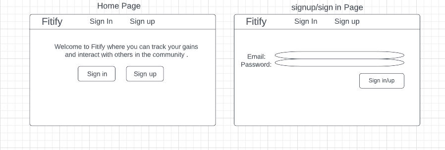
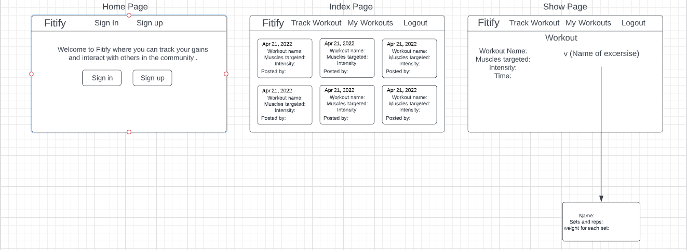
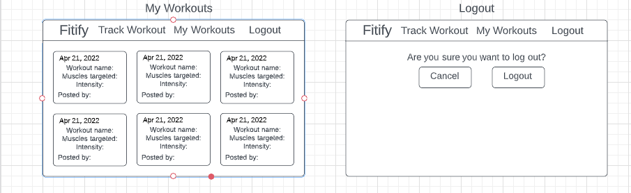

## Wireframes

## User Story

- Upon sign up/sign in, a user is able to see all of the most recent workouts.
- A user is able to sign in or sign out with and email and password.

- A user is able to make their way to the track workout page to begin logging their current workout.

- A user is able to create a workout by filling out a form with the workout name, muscles targeted, intensity, time it took to complete

- A user is able to add multiple excersises to each workout which alows the user to fill out a form for name of the excersise, sets and reps and weight for each set.

- As a user, the user is able to see the workout ocks that they created.

- A user will be able to add comments to any workout.

- A user will able to delete the comment they created.

- A user will be able to edit and delete their workout they logged.

- A user is able to edit and delete and excersise from their workout.

### Technologies:

- React
- Mongoose
- MapBox
- CSS
- MongoDB
